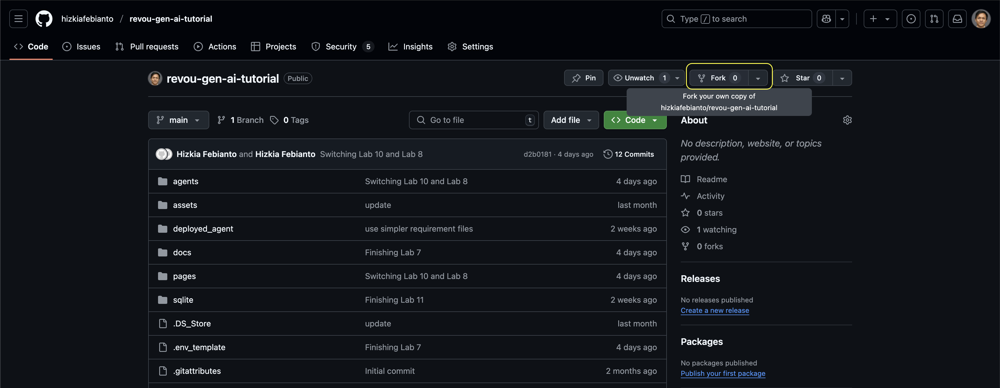
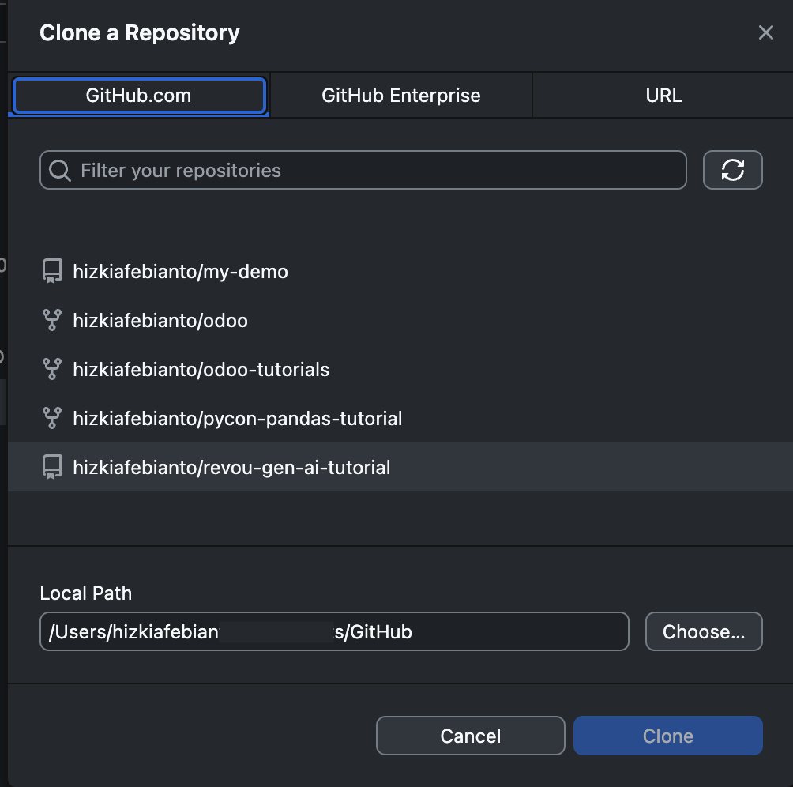
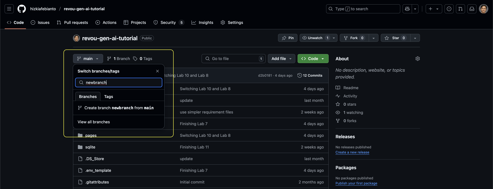
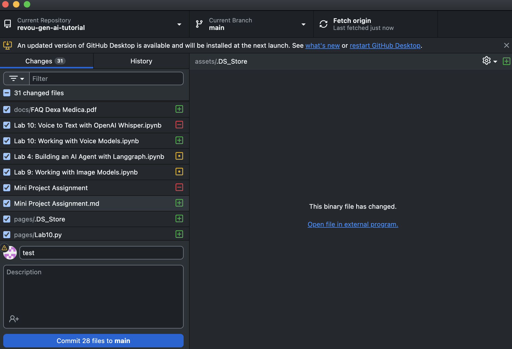
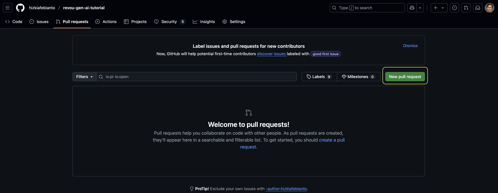

# Mini Project Assignment
## Building An Agent that can Answer Frequently-Asked Questions
In Lab 8, we built two agents. The first agent can answer user questions by generating SQL statements to fetch data from a database. The second agent can answer questions about Dexa Medica based on a document containing the company's profile. We also combined these agents and created a supervisor to manage them, allowing us to interact with both through a single chat interface built using Streamlit.

However, in day-to-day operations, customer service not only answers questions about the company profile but also handles a wide range of inquiries, which are commonly compiled in a Frequently Asked Questions (FAQ) document.

You have received a document from the Customer Service team that contains a list of commonly asked questions. They have requested you, as an expert in Agentic AI, to create a system that can intelligently replace the customer service team in answering these frequently asked questions, thereby reducing their workload.

## FAQ Document
https://github.com/hizkiafebianto/revou-gen-ai-tutorial/tree/main/docs/FAQ%20Dexa%20Medica.pdf

## Task List
1. Document Processing **[10 points]**
    * Extract the content of the PDF document using Python libraries such as PyMuPDF, pdfplumber, or PyPDF. 
    * Split the document into chunks. You can try different chunking strategies, such as chunking based on the document’s structure. 
    * Convert the chunks into embedding vectors.
2. Vector Store **[10 points]**
    * Initiate and configure a vector database to store the embedding vectors. You may explore other free vector databases, such as Milvus or Chroma.
3. Semantic Search **[15 points]**
    * Build a search feature based on semantic similarity using the embedding vectors.
    * The function should receive a question from the user and return the most relevant chunks of the document that may contain the answer to the user’s question.
4. Build the Agent **[25 points]**
    * Use LangGraph to build a tool that performs similarity search on the vector database.
    * Design the graph flow to:
        - Receive a user question
        - Perform a similarity search
        - Check if the result contains the answer
        - Generate an answer if it does
        - Otherwise, modify the query prompt and perform the search again
    * Add memory to the graph so it can store context across interactions.
5. Build the Chat Interface **[25 points]**
    * Build a chat interface using Streamlit that connects to the graph above, allowing user interaction.
    * Use Streamlit's session state to store the chat history. Optionally, add a method for the user to clear the history or delete specific messages.
    * [Extra 10 points] Store the conversation in the sidebar, similar to the ChatGPT interface.
6. Performance Measurement **[15 points]**
    * Integrate LangSmith Tracing into your graph. Analyze the graph's flow from the dashboard and use it for debugging during development.
    * Run an experiment to evaluate your model’s performance by comparing its answers with those provided in the document.
    * [Extra 10 points] Awarded to those who achieve the highest ROUGE score.
7. Integrate into existing agentic flow **[30 points]**
    * Store your agent inside the "agents" folder.
    * Call it from inside the script we made in Lab 8.
    * Modify the agent in Lab 8 to integrate your agent into the existing graph without affecting the functionality of the other two agents.

## Submission Process
1. Fork this <a href=https://github.com/hizkiafebianto/revou-gen-ai-tutorial/tree/main>Github repository</a>
2. Create a new branch.
3. Switch to your new branch and start coding.
4. Once you're finished, record a brief video explaining all the features you created. 
5. Share the link to your Github repository with the instructor.
5. Upload the video to a cloud storage platform such as Google Drive, Sharepoint, or Box.
6. Invite hizkia.febianto@gmail.com to the directory and ensure that access to the file has been granted.
7. If you're comfortable, share the video on Linkedin to showcase your project to your professional network. It's not mandatory.

## How to collaborate using Github
1. Fork the original repo on GitHub.

2. Clone your fork to your local machine. The following example is using Github Desktop.

3. Create a branch, make changes.

4. Commit and push to your fork. The following example is using Github Desktop.

5. Open a pull request to the original repo.

### Scoring
Total score = 130 points + 20 possible extra points.